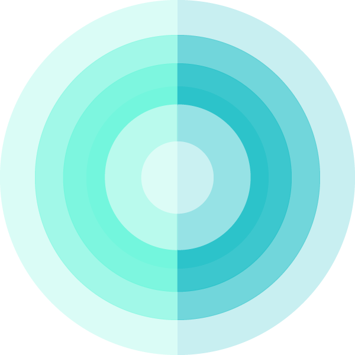

# 「 Entropyfi - Static Design Resource 」

**_<a href="https://www.entropyfi.com/">WWW.ENTROPYFI.COM</a>_** / 📦 entropyfi all design resource library.

# 快速开始

## 目录 & 索引

资源文件以 `文件类型`、`归属` 划分 `目录/文件夹`，文件名由 `{ 归属 }_{ 名称 }_{ 透明度 }.{ 扩展名 }` 构成。

<!-- JS!LOOKME! -->
<!-- JS!LOOKME! -->
